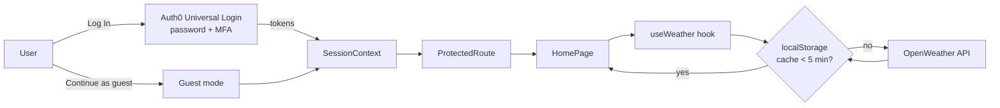

<div align="center">


# කාලගුණේ

**Your Weather, Your Way**: a secure, modern weather dashboard with live conditions, forecasts and air quality for every city you care about.

_කාලගුණේ (kaalagune) means "the weather" in Sinhala._

[](https://kaalagune-app.vercel.app/)


</div>

---

## Table of contents

- [Try it](#-try-it)
- [Features](#-features)
- [Security with Auth0](#-security-with-auth0)
- [Technical highlights](#-technical-highlights)
- [Architecture](#-architecture)
- [Run it locally](#-run-it-locally)
- [Deployment](#-deployment)
- [Tech stack](#-tech-stack)

---

## 🔗 Try it

**Live app:** https://kaalagune-app.vercel.app/

### Option 1: Guest mode (fastest)

Click **Continue as guest** on the login page. No account needed, and you get the full dashboard. You can switch to a real account any time with **Sign in** in the header.

### Option 2: Log in with Auth0 + MFA

Public sign-ups are disabled, so only pre-registered users can log in. A test account is provided:

| Email | Password |
|---|---|
| `careers@fidenz.com` | `Pass#fidenz` |

1. Click **Log In** and enter the email and password above.
2. Complete **multi-factor authentication** (MFA). Choose a method and enter the code you receive. Use **Try another method** to switch between the available factors.
3. You're in. Search for any city or use your current location.

---|---|
| `careers@fidenz.com` | `Pass#fidenz` |

1. Open the live app and click **Log In**.
2. Enter the email and password above.
3. Complete **multi-factor authentication** (MFA). Choose a method and enter the code you receive. Use **Try another method** to switch between the available factors.
4. You're in. Search for any city or use your current location.

---

## ✨ Features

| | |
|---|---|
| 🌡️ **Current conditions** | Temperature, feels-like, today's high/low, condition icon and the city's **live local time** |
| 💡 **Smart tips** | Plain-language advice from the forecast: umbrella reminders, heat, cold, wind, fog and air quality warnings |
| ⏱️ **24-hour forecast** | Interactive temperature chart with rain chances. Hover any hour for details |
| 📅 **5-day forecast** | Daily highs and lows drawn as range bars against the whole week |
| 🍃 **Air quality** | AQI from Good to Very poor, with health advice and PM2.5, PM10, O₃, NO₂ levels |
| 🧭 **Wind** | Animated compass with direction, gusts and a Beaufort-scale description |
| 🌅 **Sun** | Sunrise, sunset and day length, with the sun's position on a daylight arc |
| 📊 **Highlights** | Humidity and dew point, pressure, visibility, cloud cover and precipitation, each with a one-line explanation |
| 🔍 **Search** | City autocomplete (keyboard friendly) and **Use my location** |
| ⭐ **Saved cities** | Add or remove favourites; remembered between visits |
| 🌡️ **°C / °F** | One toggle switches temperature, wind (km/h ↔ mph), visibility (km ↔ mi) and rain (mm ↔ in) |
| 🎨 **Living background** | Gradient changes with the weather and day/night: sunny, night, clouds, rain, storm, snow, fog |
| 📱 **Responsive** | Sidebar layout on desktop, swipeable saved cities on mobile |

---

## 🔐 Security with Auth0

Authentication is handled entirely by [Auth0](https://auth0.com/) using the official `@auth0/auth0-react` SDK.

- **Universal Login + PKCE.** Users log in on Auth0's hosted page, never on ours, so the app never sees a password. The SDK uses the Authorization Code flow with **PKCE**, the recommended flow for single-page apps (you can see `code_challenge` in the login URL).
- **Multi-factor authentication.** After the password, users must complete a second factor. Configured factors: Email one-time code, Auth0 Guardian push notification, and recovery codes.
- **Invite-only access.** Public sign-ups are disabled in the Auth0 database connection.
- **Guest mode.** Visitors can explore the dashboard without an account. A `SessionContext` combines the Auth0 login and the guest flag, so components ask one question ("is someone signed in?") and never talk to Auth0 directly. A real login always replaces guest mode.
- **Protected routes.** `ProtectedRoute` checks `isAuthenticated` before rendering the dashboard and redirects everyone else to `/login`. A full-screen loader shows while Auth0 restores the session, so the page never flashes the wrong screen.
- **Sessions that survive a refresh.** `useRefreshTokens` with `cacheLocation="localstorage"` keeps users signed in across reloads using rotating refresh tokens, instead of third-party cookies that modern browsers block.
- **Clean logout.** Sign out ends the Auth0 session and returns to `/login`. Signed-in users who open `/login` are sent straight to the dashboard.

```jsx
// src/main.jsx
<Auth0Provider
  domain={domain}
  clientId={clientId}
  authorizationParams={{ redirect_uri: window.location.origin }}
  cacheLocation="localstorage"
  useRefreshTokens={true}
>
```

---

## 🛠️ Technical highlights

### 1. API layer with a smart cache — [`src/services/weatherApi.js`](src/services/weatherApi.js)

All OpenWeather calls go through one Axios instance and a small `cachedGet()` helper:

- Responses are stored in `localStorage` with a timestamp and reused for **5 minutes**, which saves API quota and makes switching cities instant.
- City search results are cached for **24 hours**, because place names don't change.
- The refresh button passes `{ force: true }` to skip the cache.
- A broken cache entry or full storage never breaks the app: every storage access is wrapped in `try/catch`.

### 2. Chained, parallel data loading — [`src/hooks/useWeather.js`](src/hooks/useWeather.js)

```
current weather (by city id or coordinates)
        │  gives exact lat/lon
        ▼
forecast  +  air quality      ← fetched in parallel with Promise.all
```

Air quality is optional: if that call fails, the rest of the dashboard still loads. The hook **auto-refreshes every 5 minutes** and clears its timer on unmount.

### 3. Correct local time for every city — [`src/utils/time.js`](src/utils/time.js)

OpenWeather returns UTC timestamps plus the city's timezone offset. Shifting by the offset and formatting in UTC shows Tokyo's sunrise in Tokyo time, whether you're browsing from Colombo or London.

### 4. Forecast processing — [`src/utils/forecast.js`](src/utils/forecast.js)

The free API returns 40 data points in **3-hour steps**. The app turns them into:

- **Hourly:** the next 24 hours (8 points), including expected rain and snow.
- **Daily:** points grouped by the city's *local* calendar date, with min/max temperature, highest rain chance, total precipitation, and the condition closest to **midday** as that day's icon.

### 5. Hand-built SVG chart, no chart library — [`src/components/HourlyForecast.jsx`](src/components/HourlyForecast.jsx)

- Smooth curve drawn with cubic Bézier segments.
- A `ResizeObserver` stretches the chart to fit the card, and it scrolls horizontally on small screens.
- Hover crosshair and tooltip, kept inside the scroll area.
- An accessible `aria-label` summarises the temperature range for screen readers.

### 6. Smart tips engine — [`src/utils/tips.js`](src/utils/tips.js)

A small set of rules turns raw numbers into advice: rain probability and timing in the next 12 hours, thunderstorms, freezing or very hot feels-like temperatures, clear sunny skies, strong wind and gusts, low visibility, poor air quality, and big daily temperature swings.

### 7. Units converted only for display — [`src/utils/units.js`](src/utils/units.js)

Data is always fetched in metric and converted when shown, so the cache works for both °C and °F users. It also calculates **dew point** (Magnus formula) and **Beaufort** wind descriptions.

### 8. Design system and motion

- **Tailwind CSS v4** with custom `@utility` classes for the frosted-glass cards (`glass`) and hidden scrollbars.
- Weather-based themes are plain Tailwind gradient classes, picked from the condition and whether the sun is up.
- **Motion** (Framer Motion) handles card entrance, the floating icon, the background cross-fade and the compass needle.
- **Noto Sans Sinhala** renders the කාලගුණේ name the same on every device.

### 9. Developer-friendly setup

- If an environment variable is missing, the app shows a clear message naming it, instead of a broken Auth0 redirect.
- [`.env.example`](.env.example) documents every required variable.
- [`vercel.json`](vercel.json) rewrites all routes to `index.html`, so deep links like `/login` work on refresh.

---

## 🧱 Architecture

```
src/
├── main.jsx                  # Auth0 + settings providers, env check
├── App.jsx                   # Routes and toast styling
├── pages/
│   ├── loginPage.jsx         # Branded login screen
│   └── homePage.jsx          # Dashboard layout and state
├── components/
│   ├── Header.jsx            # Brand, search, °C/°F, user menu
│   ├── SearchBar.jsx         # Debounced autocomplete + geolocation
│   ├── SavedCities.jsx       # Favourites list
│   ├── CityCard.jsx          # Compact city card
│   ├── CurrentWeather.jsx    # Hero card
│   ├── WeatherTips.jsx       # Smart tips
│   ├── HourlyForecast.jsx    # SVG temperature chart
│   ├── DailyForecast.jsx     # 5-day range bars
│   ├── Footer.jsx
│   ├── protectedRoute.jsx    # Auth guard
│   ├── highlights/           # Wind, Sun, Air quality, stat tiles
│   └── ui/                   # Brand, GlassCard, Skeleton, WeatherBackground
├── context/
│   ├── SessionContext.jsx    # Auth0 login + guest mode in one place
│   └── SettingsContext.jsx   # °C/°F preference
├── hooks/                    # useWeather, useLocalStorage
├── services/weatherApi.js    # OpenWeather client + cache
└── utils/                    # time, units, forecast, tips, weatherTheme
```



---

## 💻 Run it locally

**Requirements:** Node.js 20+, an [OpenWeather](https://home.openweathermap.org/api_keys) API key (free plan is enough) and an [Auth0](https://auth0.com/) Single Page Application.

```bash
git clone https://github.com/AshanOdi/Weather-App.git
cd Weather-App
npm install
cp .env.example .env    # then fill in your values
npm run dev             # http://localhost:5173
```

### Environment variables

| Variable | Where to find it |
|---|---|
| `VITE_REACT_APP_AUTH0_DOMAIN` | Auth0 → Applications → your app → Settings → **Domain** (no `https://`) |
| `VITE_REACT_APP_AUTH_CLIENT_ID` | Same page → **Client ID** |
| `VITE_REACT_APP_AUTH_OPEN_WEATHER_API` | OpenWeather → **API keys** |

> Restart `npm run dev` after editing `.env`. Vite reads it only on startup.

### Auth0 application settings

| Field | Value |
|---|---|
| Allowed Callback URLs | `http://localhost:5173, https://kaalagune-app.vercel.app` |
| Allowed Logout URLs | `http://localhost:5173/login, https://kaalagune-app.vercel.app/login` |
| Allowed Web Origins | `http://localhost:5173, https://kaalagune-app.vercel.app` |

To enable MFA: **Auth0 Dashboard → Multi-factor Auth** → turn on the factors you want → set **Require Multi-factor Auth** to **Always**.

### Scripts

| Command | What it does |
|---|---|
| `npm run dev` | Start the dev server with hot reload |
| `npm run build` | Production build into `dist/` |
| `npm run preview` | Serve the production build locally |
| `npm run lint` | Run ESLint |

---

## 🚀 Deployment

The app is deployed on **Vercel**, connected to this GitHub repo:

- Every push to `main` builds and deploys to production automatically.
- Pushes to other branches get their own **preview** URL.
- Environment variables live in **Vercel → Settings → Environment Variables**. Vite bakes them into the build, so **redeploy** after changing them.
- `vercel.json` handles client-side routing for the single-page app.

---

## 🧰 Tech stack

| Area | Tools |
|---|---|
| Framework | React 19, Vite 7 |
| Styling | Tailwind CSS v4, Motion, React Icons (Feather, Weather Icons) |
| Routing | React Router 7 |
| Auth | Auth0 (`@auth0/auth0-react`): Universal Login, PKCE, refresh tokens, MFA, plus guest mode |
| Data | OpenWeather (current weather, 5 day / 3 hour forecast, air pollution, geocoding), Axios |
| UX | React Hot Toast, Google Fonts (Inter, Noto Sans Sinhala) |
| Hosting | Vercel |

---

<div align="center">

Weather data provided by [OpenWeather](https://openweathermap.org/) · Authentication by [Auth0](https://auth0.com/)

Built by **[Ashan Odithya](https://github.com/AshanOdi)**

</div>
